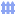
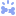
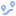
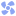
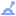
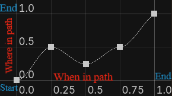
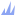
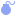

# Documentation

It is essential to know how to use the **addon**. In this file I will provide you the details on how to use it!

- [Starting](#starting)
    *  [Platforms](#platforms-)
    *  [Props and Hazards](#props-and-hazards-)

- [Specific](#specific)
    *  [Break Platform](#break-platform-)
    *  [Moving Platform](#moving-platform-)
    *  [Triggered Moving Platform](#triggered-moving-platform-)
    * [Props Or Hazards](#props-or-hazards)
        -  [Fan](#fan-)

- [The additional](#the-additional)
    *  [Lever](#lever-)
    *  [Physical Button](#physical-button-)
    * [How to add them](#how-to-add-them)

- [Addon Details](#addon-details)

# Starting

The addon is based on 3 scripts that all nodes extend, [Platform](PlatformFramework/BaseScripts/PlatformBaseScript.gd), [Trigger](PlatformFramework/BaseScripts/Triggers.gd) and [Prop or Hazard](PlatformFramework/BaseScripts/PropOrHazard.gd), that way most of the platforms, triggers and props are in need of the same setup!

> [!NOTE]
> To achieve this you should not use *_process*, **_physics_process** or ***_ready*** functions. You should use *_update*, **_physics_update** and ***_from_start***!

## Platforms 

This is the base setup for all generic platforms, inheriting from `PlatformBaseScript.gd`.

| Name | Default | Description | Type |
| :--- | :---: | :---: | ---: |
| Sprite | `null` | The Node2D that will be used for showing visuals. It MUST be a *Sprite2D* or *AnimatedSprite2D*. | [Node2D](https://docs.godotengine.org/en/stable/classes/class_node2d.html) |
| Collision Shape | `null` | The CollisionShape2D that will provide the collision for the ***platform***. | [CollisionShape2D](https://docs.godotengine.org/en/stable/classes/class_collisionshape2d.html) |
| Debug Color | `#0099b36b` | Custom debug color for the collision shape. | [Color](https://docs.godotengine.org/en/stable/classes/class_color.html) |
| Texture | `null` | The Texture2D of the terrain. Used if Sprite is a *Sprite2D*. | [Texture2D](https://docs.godotengine.org/en/stable/classes/class_texture2d.html) |
| Spriteframes | `null` | The SpriteFrames of the terrain. Used if Sprite is an *AnimatedSprite2D*. | [SpriteFrames](https://docs.godotengine.org/en/stable/classes/class_spriteframes.html) |
| Texture Width | 32 | The texture's width. If greater than the original, it tiles a second texture. | [int](https://docs.godotengine.org/en/stable/classes/class_int.html) |
| Texture Height | 32 | The texture's height. If greater than the original, it tiles a second texture. | [int](https://docs.godotengine.org/en/stable/classes/class_int.html) |
|Region|`false`|If **enable**, the Sprite2D will use the region that you will place.| [bool](https://docs.godotengine.org/en/stable/classes/class_bool.html) |
|Rect|( 0,0,0,0 ) | The position of the tileset you want to show your ***platform***.|[Rect2i](https://docs.godotengine.org/en/stable/classes/class_rect2i.html#rect2i)
| Enable (One Way) | `false` | If enabled, characters can jump through the ***platform*** from the specified direction. | [bool](https://docs.godotengine.org/en/stable/classes/class_bool.html) |
| Way Pass ***Platform*** |NORTH| The cardinal direction from which the player can pass through the ***platform***. | [enum (int)](https://docs.godotengine.org/en/stable/tutorials/best_practices/data_preferences.html#enumerations-int-vs-string) |
| Enable (Circle) | `false` | If enabled, overrides the cardinal direction and allows arbitrary angle rotation for one-way collision. | [bool](https://docs.godotengine.org/en/stable/classes/class_bool.html) |
| Degrees (Circle) | `0` | The exact angle in degrees for the one-way collision pass-through. | [float](https://docs.godotengine.org/en/stable/classes/class_float.html) |
| Is Attacking | `false` | If enabled, your ***platform*** has a Hazard (e.g., spikes). | [bool](https://docs.godotengine.org/en/stable/classes/class_bool.html) |
| Damage | 5.0 | The health your hazard will reduce per hit. | [float](https://docs.godotengine.org/en/stable/classes/class_float.html) |
| Activate Time | 0.2 | The time (in seconds) that the hazard will wait until it activates. | [float](https://docs.godotengine.org/en/stable/classes/class_float.html) |
| Active Time | 0.2 | The time (in seconds) that the hazard will remain active and deadly. | [float](https://docs.godotengine.org/en/stable/classes/class_float.html) |
| Auto Size Attack | `true` | If false, the script will stop auto-sizing the hitbox so you can build it manually. | [bool](https://docs.godotengine.org/en/stable/classes/class_bool.html) |
| Attack | `null` | The secondary CollisionShape2D used exclusively for the HitBox. | [CollisionShape2D](https://docs.godotengine.org/en/stable/classes/class_collisionshape2d.html) |
| Location of Attack | NORTH| The cardinal direction your hazard will be facing. | [enum (int)](https://docs.godotengine.org/en/stable/tutorials/best_practices/data_preferences.html#enumerations-int-vs-string) |
| Attack Reach | 3.0 | How far (in pixels) the attack will extend from the main ***platform***. | [float](https://docs.godotengine.org/en/stable/classes/class_float.html) |
| Enable (Dir Circle)| `false` | If **enabled**, the location of attack is overwritten and defined by an orbital circle. | [bool](https://docs.godotengine.org/en/stable/classes/class_bool.html) |
| Degrees (Dir Circle)| 0.0 | The exact orbital degrees on an XY axis system for hazard placement. | [float](https://docs.godotengine.org/en/stable/classes/class_float.html) |

## Triggers 

This is the base setup for all interactable switches, inheriting from `Triggers.gd`.

| Name | Default | Description | Type |
| :--- | :---: | :--- | ---: |
| Use Point | `null` | The Area2D that searches for a person or object to trigger the switch. | [Area2D](https://docs.godotengine.org/en/stable/classes/class_area2d.html) |
| Sprite | `null` | The visual node. It MUST be an *AnimatedSprite2D* or a *Sprite2D*. | [Node2D](https://docs.godotengine.org/en/stable/classes/class_node2d.html) |

## Props and Hazards 

This is the base setup for all generic obstacles, decorations, and traps, inheriting from `PropOrHazard.gd`.

| Name | Default | Description | Type |
| :--- | :---: | :---: | ---: |
| Sprite Still | `null` | The Sprite2D that holds the texture. It is useless if Visual Type is *Animated*. | [Sprite2D](https://docs.godotengine.org/en/stable/classes/class_sprite2d.html) |
| Sprite Animated | `null` | The AnimatedSprite2D that holds the texture. It is useless if Visual Type is *Still*. | [AnimatedSprite2D](https://docs.godotengine.org/en/stable/classes/class_animatedsprite2d.html) |
| Collision Shape | `null` | The CollisionShape2D that defines the physical collision of the ***Prop or Hazard***. | [CollisionShape2D](https://docs.godotengine.org/en/stable/classes/class_collisionshape2d.html) |
| Hitbox Component | `null` | The custom HitBox component used to deal damage. Not needed for standard ***Props***. | [HitBox](/Components/hitbox_component.gd) -> [Area2D](https://docs.godotengine.org/en/stable/classes/class_area2d.html#area2d) |
| Hitbox Shape | `null` | The CollisionShape2D that defines the HitBox area of the ***Hazard***. | [CollisionShape2D](https://docs.godotengine.org/en/stable/classes/class_collisionshape2d.html) |
| Visual Type | Still | Choose whether this ***prop*** uses a still texture or an animated sequence. | [enum (int)](https://docs.godotengine.org/en/stable/tutorials/best_practices/data_preferences.html#enumerations-int-vs-string) |
| Texture Still | `null` | The Texture2D used if Visual Type is set to *Still*. | [Texture2D](https://docs.godotengine.org/en/stable/classes/class_texture2d.html) |
| Texture Animated | `null` | The SpriteFrames used if Visual Type is set to *Animated*. | [SpriteFrames](https://docs.godotengine.org/en/stable/classes/class_spriteframes.html) |
| Is Hazard | `false` | If **enabled**, this ***prop*** will deal damage to HurtBoxes. | [bool](https://docs.godotengine.org/en/stable/classes/class_bool.html) |
| Damage | 10.0 | The amount of health points this ***hazard*** reduces. | [float](https://docs.godotengine.org/en/stable/classes/class_float.html) |
| Active Time (Pulse) | 0.0 | The time (in seconds) the ***hazard*** stays active. | [float](https://docs.godotengine.org/en/stable/classes/class_float.html) |
| Rest Time (Pulse) | 0.0 | The time (in seconds) the ***hazard*** waits before activating. | [float](https://docs.godotengine.org/en/stable/classes/class_float.html) |

# Specific

## Break Platform 

This node inherits from `Platform.gd` but acts as a fragile surface that crumbles when stood upon. 

| Name | Default | Description | Type |
| :--- | :---: | :---: | ---: |
| Break Time | 1.0 | The time (in seconds) the player can stand on the platform before it vanishes. | [float](https://docs.godotengine.org/en/stable/classes/class_float.html) |
| Area | `null` | The *Area2D* that detects if someone is standing on top of the platform. | [Area2D](https://docs.godotengine.org/en/stable/classes/class_area2d.html) |
| Area Collision Shape | `null` | The *CollisionShape2D* used by the *Area2D* to detect the player. Automatically resized to match the platform. | [CollisionShape2D](https://docs.godotengine.org/en/stable/classes/class_collisionshape2d.html) |

## Moving Platform 

This node inherits from `Platform.gd` and follows a specific path.
> [!NOTE]
> The node this script is attached to MUST be an [AnimatableBody2D](https://docs.godotengine.org/en/stable/classes/class_animatablebody2d.html#animatablebody2d).

| Name | Default | Description | Type |
| :--- | :---: | :---: | ---: |
| Speed | 150.0 | The speed at which the ***platform*** will move. | [float](https://docs.godotengine.org/en/stable/classes/class_float.html) |
| Path | `null` | The *Path2D* the ***platform*** will follow. Must be assigned for movement to work. | [Path2D](https://docs.godotengine.org/en/stable/classes/class_path2d.html) |
| Movement Type | CLASSIC | Defines the movement logic (Classic, Accelerated, or Graph). | [enum (int)](https://docs.godotengine.org/en/stable/tutorials/best_practices/data_preferences.html#enumerations-int-vs-string) |
| Wait Time | 1.0 | The time (in seconds) the ***platform*** rests before moving again (Hidden in Graph mode). | [float](https://docs.godotengine.org/en/stable/classes/class_float.html) |
| Graph | `null` | The Curve that dictates movement. Used exclusively when Movement Type is GRAPH. | [Curve](https://docs.godotengine.org/en/stable/classes/class_curve.html) |

- **Classic / Accelerated Modes**: Uses a physics-synced `Tween` to interpolate `progress_ratio`. When toggled mid-route, it recalculates the remaining duration proportionally so speed stays consistent without jarring snaps.

> [!NOTE]
> Your [Path2D](https://docs.godotengine.org/en/stable/classes/class_path2d.html) MUST BE a **sibling** of the platform!

> [!TIP]
> Pressing play resets the animation, while stop terminates it!

### Curve explanation

Curve is used to define the how the ***platform*** will follow the given path.

- **X Axis**: Is the travel time we have. *Zero* is the start while *One* is the end.

- **Y Axis**: Is the distance from the start of your path. *Zero* is the start and *One* is the end.

> [!NOTE]
> Changing Maximum and Minimum values on any axis will break the platform.

#### Examples



1. The first Point is at (0,0) so *when* we start moving, we are at the start of the path.
2. The second Point is at (0.25, 0.5) so *when* we do $\frac{1}{4}$ of the travel time, the ***platform*** will be at the half of the path.
3. The 3rd Point is at (0.5, 0.25) so *when* we have made half the travel time, the **platform** has gone back to $\frac{1}{4}$ of the whole path.
4. The 4th Point is at (0.75, 0.5) so *when* we do $\frac{3}{4}$ of the travel time, the ***platform*** will be, again, at the half of the path.
5. The last Point is (1,1) so *when* we complete the travel time, the ***platform*** is at the end of the path.

> [!TIP]
> How points are connected to each other, matters on how the ***platform*** will move there!

## Triggered Moving Platform 

This node inherits from `MovingPlatform.gd`. Instead of looping infinitely, it stays idle until activated by a connected `Trigger` (such as a [Lever](#lever-) or [Physical Button](#physical-button-)).

> [!NOTE]
> Like the base Moving Platform, this node MUST be an [AnimatableBody2D](https://docs.godotengine.org/en/stable/classes/class_animatablebody2d.html#animatablebody2d) and requires a valid [Path2D](https://docs.godotengine.org/en/stable/classes/class_path2d.html) to operate. Also, your [Path2D](https://docs.godotengine.org/en/stable/classes/class_path2d.html) MUST BE a **sibling** of the platform!

| Name | Default | Description | Type |
| :--- | :---: | :---: | ---: |
| Trigger | `null` | The interactable *Trigger* node (Lever, Physical Button) controlling this ***platform***. | [Trigger](#triggers-) |

#### How It Works:

JUST LIKE [MOVEMENT PLATFORM](#moving-platform-)

# Props Or Hazards

## Fan 

This node inherits from `PropOrHazard.gd` and creates a directional wind zone.

| Name | Default | Description | Type |
| :--- | :---: | :---: | ---: |
| Wind Zone | `null` | The *Area2D* that covers the piece of land the ***Fan*** is hitting. | [Area2D](https://docs.godotengine.org/en/stable/classes/class_area2d.html) |
| Wind Direction | UP | In which direction the ***Fan*** is pushing the bodies that air is hitting (UP, DOWN, LEFT, RIGHT). | [enum (int)](https://docs.godotengine.org/en/stable/tutorials/best_practices/data_preferences.html#enumerations-int-vs-string) |
| Wind Strength | 1500.0 | Force of the air applied to valid physics bodies. | [float](https://docs.godotengine.org/en/stable/classes/class_float.html) |
| Non Physics Dampener | 0.05 | A value that is reducing the force for objects that have no gravity (e.g. Area2D). | [float](https://docs.godotengine.org/en/stable/classes/class_float.html) |

# The additional

## Lever 

An interactable switch, inherits `Trigger`, that can be toggled by the player.

| Name | Default | Description | Type |
| :--- | :---: | :---: | ---: |
| Starting Position | RIGHT| Defines whether the ***Lever*** starts in the LEFT or RIGHT position. | [enum (int)](https://docs.godotengine.org/en/stable/tutorials/best_practices/data_preferences.html#enumerations-int-vs-string) |
|Directional Lever|`true`|If **true**, the ***Lever*** is going to turn if it is pushed from the correct side.|[bool](https://docs.godotengine.org/en/stable/classes/class_bool.html)|
| Animation Play | RIGHT TO LEFT| If the sprite is an *AnimatedSprite2D*, sets the native animation direction. | [enum (int)](https://docs.godotengine.org/en/stable/tutorials/best_practices/data_preferences.html#enumerations-int-vs-string) |
|Anim Time|0.27|Time (in seconds) that the ***Lever*** cannot be turned. If you use an *AnimatedSprite2D* it is overwritten by the seconds of the animation.|[float](https://docs.godotengine.org/en/stable/classes/class_float.html)|

## Physical Button 

A physics-driven button, inherits `Trigger`, that depresses when objects are placed on top of it.

| Name | Default | Description | Type |
| :--- | :---: | :---: | ---: |
|Press Time|1.0|How much time the animation should be.|[float](https://docs.godotengine.org/en/stable/classes/class_float.html)|
| Offset | 10.0 | How many pixels downward the button should move when pressed. | [float](https://docs.godotengine.org/en/stable/classes/class_float.html) |

### How to add them

The Interactables in this pack ([Lever](#lever-) and [PhysicalButton](#physical-button-)) are completely modular. They communicate with your game world using Godot's built-in [Signals](https://docs.godotengine.org/en/stable/engine_details/architecture/object_class.html#signals), making them perfect master switches for custom doors, traps, or moving platforms.

Both the [Lever](#lever-) and [Physical Button](#physical-button-) emit a `toggle(is_on: bool, node: Node2D)` signal. Here is how you can easily connect them to your own custom logic.

Step-by-Step Connection:

1. Build your level using the provided platforms and interactables.

2. Select your [Lever](#lever-) and [Physical Button](#physical-button-) in the [Scene Tree](https://docs.godotengine.org/en/stable/tutorials/performance/cpu_optimization.html#scenetree).

3. Open the Node tab next to the Inspector to view its signals.

4. Double-click the toggle signal.

5. Select the target node you want to control (e.g., a custom door or a modified MovingPlatform) and hit Connect.

#### Example Implementation:

If you want to create a platform that only moves when a lever is flipped, you don't need to rewrite the whole platform! Just create a new script that extends the base MovingPlatform, disable its default physics, and add a simple receiver function for the signal:

```GDScript
extends MovingPlatform

@export var trigger:Lever # The instance of the Lever, you can use PhysicalButton.

@export var trigger_travel_time: float = 3.0 # The time it takes to reach the other side.

var _trigger_tween: Tween

func _from_start() -> void:
    # Stop the platform from moving automatically.
    set_physics_process(false)
    # Check if signal is already connected.
    if not trigger.toggle.is_connected(_on_lever_toggled):
        #If not connect it.
        trigger.toggle.connect(_on_lever_toggled)

# Connect the Lever's 'toggle' signal to this function!
func _on_lever_toggled(is_on: bool, _node: Node2D) -> void:
    if _trigger_tween and _trigger_tween.is_valid():
        _trigger_tween.kill()
        
    _trigger_tween = create_tween().set_process_mode(Tween.TWEEN_PROCESS_PHYSICS)
    
    # If the lever is ON, move to the end of the path.
    # If the lever is OFF, return to the start of the path.
    var target_ratio: float = 1.0 if is_on else 0.0
    
    _trigger_tween.tween_property(
    _path_follow,
    "progress_ratio",
    target_ratio,
    trigger_travel_time)\
        .set_trans(Tween.TRANS_SINE)\
        .set_ease(Tween.EASE_OUT)
```

> [!TIP]
> This same signal logic can be used to open doors, activate boss fights, or spawn enemies. Just connect the toggle signal to any script in your game!

# Addon Details

I provided this addon with a **Base Platform** , a **Prop**  and a **Hazard**  too! And Preset scenes for every asset, along with 3 components.